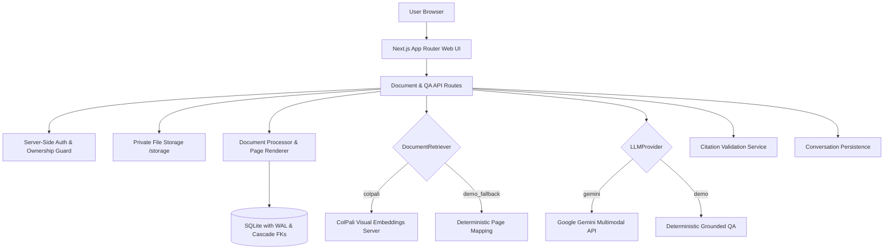

# DocuMind — Private Multimodal Document Assistant

DocuMind is a private, vision-first document intelligence assistant. Unlike conventional text-first RAG systems that extract and flatten document text into unstructured chunks, DocuMind preserves the visual context of documents (diagrams, tables, typography, and page layout) by leveraging **ColPali-centered visual retrieval** and **multimodal LLMs** to deliver grounded answers with exact page citations and interactive evidence previews.

---

## Key Features

- **ColPali Visual Retrieval Abstraction**: Modular `DocumentRetriever` supporting production `ColPaliRetriever` and deterministic `DemoFallbackRetriever`.
- **Multimodal Grounded QA**: Pluggable `LLMProvider` interface with `GeminiProvider` (Google Gemini 2.0 Flash) and `DemoLLMProvider`.
- **Exact Page Citations & Evidence Viewer**: Every statement is mapped to exact retrieved page numbers with clickable citation tags and synchronized page image previews.
- **Secure Document Processing**: Strict validation against magic bytes, structural integrity, size limits, and path traversal with UUID storage isolation.
- **Server-Side Authorization & IDOR Defense**: HMAC-SHA256 signed session cookies with constant-time verification; server-side ownership checks on every document, page, and conversation.
- **Zero-Trust Prompt Injection Isolation**: Document content and user queries are strictly isolated in `<<<EVIDENCE>>>` delimiter boundaries and treated as untrusted data, never instructions.
- **Deterministic Demo Mode**: Ships with a pre-seeded 8-page synthetic report (*"2026 Enterprise AI Adoption & Operations Report"*), pre-rendered high-resolution page previews, and deterministic QA out of the box without requiring external API keys or GPU infrastructure.

---

## Architecture Overview



### Retrieval & LLM Architecture

| Component | Production Mode | Demo / Fallback Mode |
|---|---|---|
| **Retrieval Engine** | `ColPaliRetriever` (calls ColPali model server) | `DemoFallbackRetriever` (deterministic mapping, **explicitly not ColPali**) |
| **LLM Provider** | `GeminiProvider` (`gemini-2.0-flash` multimodal) | `DemoLLMProvider` (deterministic pre-computed answers) |
| **Page Rendering** | Portable Pure-JS / Sharp SVG rendering | Pre-rendered high-res SVG/PNG synthesis |
| **Database** | SQLite (`better-sqlite3`) with WAL journal mode | SQLite (`better-sqlite3`) with pre-seeded demo report |

> **Critical Architecture Rule**: Generic text embeddings, TF-IDF, keyword search, cosine similarity on text chunks, or random vectors are **never** labeled as ColPali. The UI and logs explicitly display `ColPali Retrieval` vs `Demo Fallback (not ColPali)`.

---

## Requirements for Real ColPali Mode

To operate in full live ColPali mode:
1. Deploy a ColPali model server (e.g. `colpali-engine` with `vidore/colpali-v1.2` or `colpali-v1.3`).
2. Provide a GPU instance with >= 8GB VRAM (or a hosted inference endpoint).
3. Set in `.env.local`:
   ```bash
   RETRIEVAL_MODE=colpali
   COLPALI_ENDPOINT=https://your-colpali-service.internal:8000
   ```

---

## Requirements for Google Gemini Multimodal Mode

To enable live Google Gemini multimodal reasoning:
1. Obtain an API key from [Google AI Studio](https://aistudio.google.com/apikey).
2. Set in `.env.local`:
   ```bash
   LLM_PROVIDER=gemini
   GEMINI_API_KEY=your_gemini_api_key_here
   ```

---

## Quick Start

### Prerequisites
- Node.js 18+ (tested on Node.js 22.14.0)
- npm 9+ (tested on npm 11.3.0)

### 1. Installation
```bash
git clone https://github.com/Abhay-kavachi/documind.git
cd documind
npm install
```

### 2. Environment Configuration
Copy `.env.example` to `.env.local`:
```bash
cp .env.example .env.local
```
*(Default settings run in full deterministic demo mode with zero external dependencies).*

### 3. Seed Demo Data
Generates the 8-page synthetic AI research report PDF, renders page previews, and initializes SQLite tables:
```bash
npm run seed
```

### 4. Start Development Server
```bash
npm run dev
```
Open [http://localhost:3000](http://localhost:3000) in your browser.

---

## Verification & Testing

DocuMind includes a comprehensive automated test suite covering unit logic, authorization isolation, and security vulnerability scenarios.

```bash
# 1. Typecheck
npm run typecheck

# 2. Lint check
npm run lint

# 3. Test suite (48 tests passing)
npm run test

# 4. Production build
npm run build
```

### Security Test Coverage (`src/__tests__/security/`)

- **Authorization (`auth.test.ts`)**: Server-side user session isolation, cross-user IDOR access denial, cascade deletion guarantees, foreign key enforcement.
- **Upload Hardening (`upload.test.ts`)**: PDF magic bytes validation (`%PDF-`), corrupted PDF handling, maximum file size limits (50MB), filename sanitization, path traversal rejection (`../`, `..\\`), null-byte injection blocking.
- **Injection Defenses (`injection.test.ts`)**: Parameterized query protection against SQL injection payloads (`' OR '1'='1`, `'; DROP TABLE...`), prompt injection neutralization in both questions and document content.

---

## Project Structure

```text
documind/
├── docs/                     # Project specifications & architecture docs
│   ├── PRD.md
│   ├── TECHNICAL_ARCHITECTURE.md
│   ├── SECURITY_AND_ACCESS.md
│   ├── FRONTEND_SPEC.md
│   └── FEATURE_TICKETS.md
├── src/
│   ├── __tests__/            # Automated test suite
│   │   ├── security/         # Auth, upload, and injection tests
│   │   └── unit/             # Retrieval & citation unit tests
│   ├── app/                  # Next.js 14 App Router
│   │   ├── api/              # Secure REST API routes
│   │   │   ├── config/       # Public runtime config
│   │   │   └── documents/    # Documents, pages, images, QA routes
│   │   ├── documents/[id]/   # Split-view Document Workspace
│   │   ├── globals.css       # Clean B2B dark design system
│   │   ├── layout.tsx        # App layout with Sidebar
│   │   └── page.tsx          # Document Library
│   ├── components/           # Accessible UI components
│   │   ├── answer-display.tsx
│   │   ├── conversation-history.tsx
│   │   ├── document-card.tsx
│   │   ├── evidence-viewer.tsx
│   │   ├── page-preview-modal.tsx
│   │   ├── processing-status.tsx
│   │   ├── question-input.tsx
│   │   ├── sidebar.tsx
│   │   └── upload-dialog.tsx
│   ├── lib/                  # Core domain logic
│   │   ├── auth/             # HMAC signed session cookies & ownership guards
│   │   ├── db/               # SQLite database client & schema definitions
│   │   ├── demo/             # 8-page demo document & seed generator
│   │   ├── llm/              # LLMProvider interface, Gemini & Demo adapters
│   │   ├── logger.ts         # Structured JSON observability logger
│   │   ├── retrieval/        # DocumentRetriever, ColPali & Demo fallback
│   │   ├── services/         # Document, processor, renderer, citation services
│   │   ├── storage/          # UUID-isolated file storage with traversal guards
│   │   └── types.ts          # Central TypeScript interfaces
│   └── middleware.ts         # Security headers & routing middleware
├── .env.example              # Environment variables template (no secrets)
├── next.config.js            # Next.js build configuration
├── package.json              # Dependencies and lifecycle scripts
├── tsconfig.json             # Strict TypeScript configuration
└── vitest.config.ts          # Vitest testing configuration
```

---

## License

MIT License.
