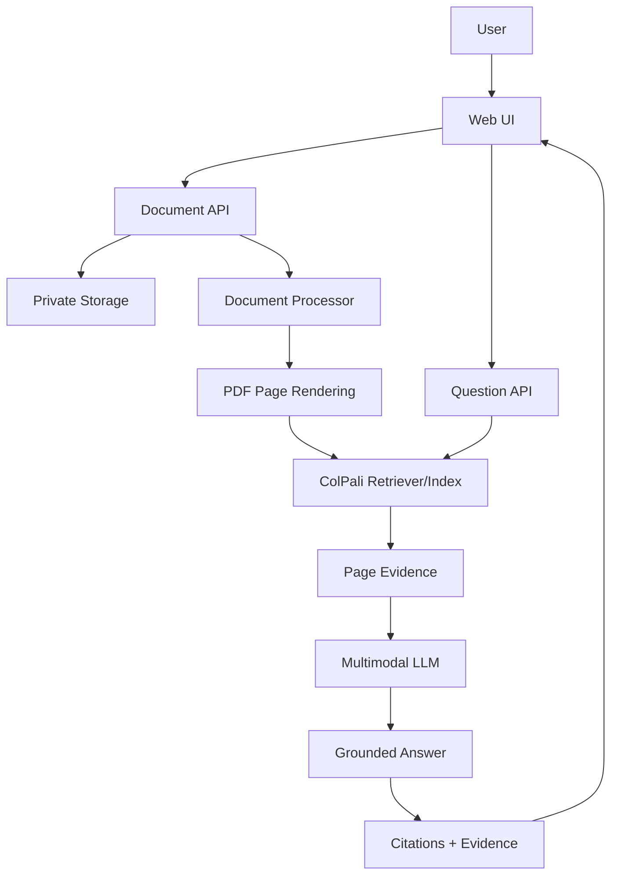

# DocuMind — Technical Architecture

## High-level flow

## Layers
- Presentation: library, upload, workspace, questions, citations, evidence.
- API: validation, authentication, authorization, document and question operations.
- Domain services: DocumentService, DocumentProcessor, PageRenderer, DocumentRetriever, ColPaliRetriever, AnswerGenerator, CitationService, ConversationService.
- Infrastructure: storage, database, model runtimes and logging adapters.

## Retrieval
Expose a `DocumentRetriever` abstraction such as `retrieve(query, documentId, topK)`. Production implementation is `ColPaliRetriever`. Supported modes should be explicit: `colpali` and `demo_fallback`.

Do not label TF-IDF, cosine similarity, generic embeddings, random vectors or keyword search as ColPali.

## Data model
Document: id, owner, title, file_name, file_url/storage_key, source, status, num_pages, doc_type, summary, error_message, timestamps.

Page: id, document_id, page_number, section_title, optional text_content, retrieval representation/index reference.

Conversation: id, document_id, owner, question, answer, citations, retrieved_pages, confidence, provenance, status, timestamp.

## Processing lifecycle
uploaded → validating → processing → rendering/indexing → ready.
Any failure → error with diagnostic information.

## Security boundary
PDF bytes, extracted text, page images, metadata and user questions are untrusted data. LLM output must not directly execute shell commands, SQL, filesystem operations, email, payments or arbitrary network requests.

## Deployment
Externalize configuration and secrets. Provide `.env.example`. Never commit real credentials.

## Observability
Structured events for upload, processing, retrieval, answer generation and failures. Never log secrets or unnecessary private document content.
